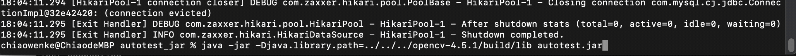
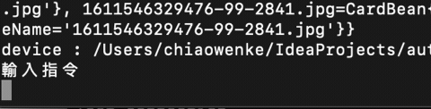
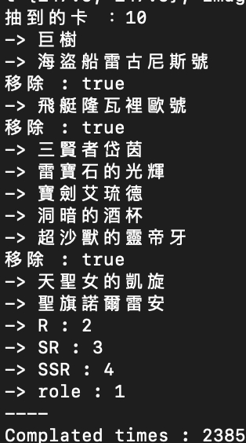

# 最後的克勞迪亞 cloudia Opencv JAVA + ADB 自動抽卡

## 曬一下我的三聖物


## 簡介
最近失業沒事做, 剛好 cloudia 有無限首抽, 閒閒來寫一下自動抽卡, 順便統計機率
這是我測試用的, 所以要用的人至少要懂環境配置.
抽卡+比對一輪大概 22秒左右

**先工商一下～我是Android APP工程師 歡迎找我外包 APP.**
> email : voarlese@gmail.com

這功能用到
* Opencv Java 
* ADB
* android模擬器 or 手機
* JAVA SDK

### 請勿拿此程式盈利

## 功能
1. 自動抽卡 - 可選擇想抽到哪些卡
用 ADB 控制手機 或模擬器, 用座標點擊位置, 目前是用1920x1080螢幕測試抽卡, 沒有測試不同解析度, 不過有做自適應.
2. 統計 (需要掛資料庫、不懂的就不用管他)
用mysql 做統計


#### 前置安裝
1. [JAVA](https://www.oracle.com/tw/java/technologies/javase/javase-jdk8-downloads.html)
2. [ADB](https://developer.android.com/studio/releases/platform-tools)
ADB 是用於控制手機, 所以必須設定環境變數讓 cmd 可以使用 adb 指令
3. [OPENCV](https://opencv.org/releases/) 
放到在autotest
需要把opencv 的 c/c++ lib檔案build出來
詳情可以看這篇, build opencv 只需要做到第二步, 把 opencv 的 dylib 弄出來就好了, run java 時候要引入

> 其他懶得寫步驟.... JAVA 、ADB 安裝好後要配置環境變數 請自己上網查囉~

## config 配置
##### path.json
重要的路徑參數

* screenShotDir
 抽卡後截圖比對存檔路徑.
* desire 
 指定要抽的卡
* img 
 用來比對的原圖路徑
* device 
 模擬器名稱路徑
* cards 
 卡片資料路徑
* sql
 資料庫路徑

建議都用絕對路徑 e.g.
```
// windows
C:/Document/autotest/compare/
// mac
/Users/myUser/autotest/compare/
```
```JSON
{
 "screenShotDir" : "your_path/autotest/compare/",
 "desire" : "your_path/autotest/config/desire.json",
 "img" : "your_path/autotest/img",
 "device" : "your_path/autotest/config/device.json",
 "cards" : "your_path/autotest/config/cards.json",
 "sql" : "your_path/autotest/config/sql.json"
}
```
---
##### 卡片資料 cards.json

原本設定用資料庫[請看這邊](https://github.com/voarlese/cloudia/blob/main/README.md),
為了給沒用資料庫的人～卡片資料用這個json檔

---
##### 想要抽卡的組合 desire.json
* name 必須使用 cards.json 內的卡片名稱(我不知道有沒有打錯字), 記得不要有空格
* desire_card : 想要抽的聖物
 + name : 是要抽的聖物名稱
 + type : 
  1 : 一定要抽到 
  0 : 依照 limit_card 數量來決定至少抽到幾張
   > 以下範例來看, limit_card : 3 中 type : 1 的卡一定要抽到.
   
* desire_role : 想要抽的角色
 + name : 是要抽的角色名稱
 + type : 
  1 : 一定要抽到
  0 : 依照 limit_card 數量來決定至少抽到幾張
   > 以下範例看 limit_role : 1, 表示 type 0 的三張卡角色中, 至少要抽到其中一個

* limit_card 的數量為 desire_card type = 1數量加總, 如果有type = 0 的選項, 要抽到幾個type = 0的再額外往上加.
 > 此例範例 limit_card 必須為3

* limit_role 的數量為 desire_role type = 1數量加總, 如果有type = 0 的選項, 要抽到幾個type = 0的再額外往上加.
    > 此例範例 limit_role 必須 為 0~3.
```JSON
 {
  "desire_card" : [{"name" : "飛艇隆瓦裡歐號", "type" : 1},{"name" : "超沙獸的靈帝牙", "type" : 1},{"name" : "海盜船雷古尼斯號", "type" : 1}],
  "desire_role" : [{"name" : "冰之刹姬賽維婭", "type" : 0},{"name" : "戈爾穆王子", "type" : 0},{"name" : "公主莉拉", "type" : 0}],
  "limit_card" : 3,
  "limit_role" : 1
 }
```

> 想要雙聖物 另外加一張卡 可以這樣設定
> 此時 一定會抽到 超沙獸的靈帝牙、海盜船雷古尼斯號, 剩下的 魔獸獵人、天聖女的凱旋、飛艇隆瓦裡歐號 有中其中一張都算完成
```
{
 "desire_card" : [{"name" : "魔獸獵人", "type" : 0},{"name" : "天聖女的凱旋", "type" : 0},{"name" : "飛艇隆瓦裡歐號", "type" : 0},{"name" : "超沙獸的靈帝牙", "type" : 1},{"name" : "海盜船雷古尼斯號", "type" : 1}],
 "desire_role" : [{"name" : "冰之刹姬賽維婭", "type" : 0},{"name" : "戈爾穆王子", "type" : 0},{"name" : "公主莉拉", "type" : 0}],
 "limit_card" : 3,
 "limit_role" : 1
}
```
---
##### device.json
模擬器名稱

```JSON
{
 "device" : "192.168.100.139:5558"
}
```
 > 取得方式
  ```zsh
# 輸入 adb devices  查詢 目前連線的 模擬器
xxx@xxx shell % adb devices
List of devices attached
192.168.100.139:5558 device
  ```
192.168.100.139:5558 就是我的模擬器名稱
---
##### sql.json
資料庫參數, 沒有掛資料庫的話 JDBC_URL 不要填東西, 想掛資料庫做統計 可以去看我的[資料庫建置](https://github.com/voarlese/cloudia/blob/main/README.md)
> 連線路徑範例 : "jdbc:mysql://192.168.100.122:3307/cloudia"
```JSON
{
 "JDBC_URL" : "",
 "USERNAME" : "root",
 "PASSWORD" : "1234"
}
```
---
#### USE
打開終端機
``` zsh
#進入 /out/artifacts/autotest_jar, 建議用絕對路徑, 這是已經在 autotest 資料夾內的寫法
cd /out/artifacts/autotest_jar
# 路徑有問題的話可以用絕對位置
java -jar -Djava.library.path=../../../opencv-4.5.1/build/lib autotest.jar
```
接下來會看到 


**接下來把手機或模擬器畫面操作到無限抽的畫面, 要這個畫面**


然後在這裡輸入 auto 就可以開始自動抽卡了

 

### 停止

**抽到後會自動停止, 或是按CTRL + C**




## 統計
我弄了資料庫來統計機率～這才是這專案主要目的
[要掛資料庫～請看這邊](https://github.com/voarlese/cloudia/blob/main/README.md)

